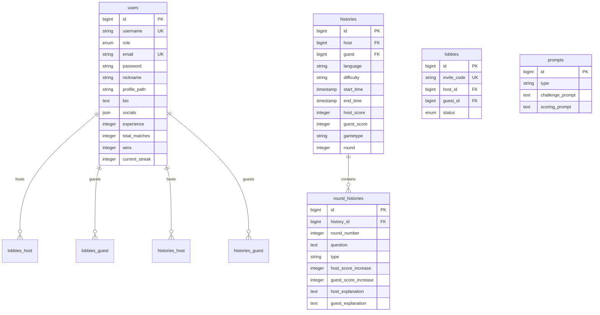

<div align="center">
  

  # DevUp

  ### 🎮 AI-Powered Competitive Coding Arena

  **Code. Compete. Level Up!**

  [](https://laravel.com)
  [](https://reactjs.org)
  [](https://www.typescriptlang.org)
  [](https://tailwindcss.com)
  [](https://inertiajs.com)

  [Features](#-features) • [Demo](#-demo) • [Installation](#-installation) • [Tech Stack](#-tech-stack) • [Documentation](#-documentation)

</div>

---

## 🚀 **IMPLEMENTATION COMPLETE!**

> **✅ The full DevUp platform with AI-powered evaluation is now ready to use!**

### 📚 **Quick Links:**
- **[⚡ NEXT_STEPS.md](NEXT_STEPS.md)** - What you need to do RIGHT NOW (10 minutes)
- **[🏃 QUICKSTART.md](QUICKSTART.md)** - 5-minute setup guide
- **[📖 IMPLEMENTATION.md](IMPLEMENTATION.md)** - Complete technical documentation
- **[✅ CHECKLIST.md](CHECKLIST.md)** - Testing and verification guide
- **[🏗️ ARCHITECTURE.md](ARCHITECTURE.md)** - System architecture & flow diagrams

### ⚡ **To Get Started:**
```bash
# 1. Add your Gemini API key to .env
GEMINI_API_KEY=your_key_here

# 2. Run these commands:
php artisan migrate
php artisan db:seed --class=PromptSeeder
npm run build
php artisan serve
```

**That's it!** Visit http://localhost:8000 and start battling! 🎮

---

## 📖 About

**DevUp** is an innovative gamified learning platform designed to sharpen programming skills through structured competitive coding challenges. Built for **Sevent 9.0** under the theme **"Game, Code, and Play – Sharpening Creativity and Skills in the Arena of Competition"** with the subtheme **"AI for New Opportunities"**.

DevUp leverages **Artificial Intelligence** as an intelligent evaluator to validate and score code solutions objectively. The platform enables users to create private lobbies, invite friends, and compete in real-time coding battles across multiple programming languages.

### 🎯 Vision

Transform coding education into an engaging, competitive, and interactive experience where developers of all levels can improve their skills through peer competition and AI-powered feedback.

---

## ✨ Features

### 🤖 **AI-Powered Evaluation**
- Intelligent code validation and scoring
- Real-time feedback on code quality, functionality, and efficiency
- Comprehensive error analysis and solution suggestions
- Automated learning insights after each round

### 🎮 **Competitive Multiplayer**
- **Create Lobbies**: Host private rooms with custom invite codes
- **Join Battles**: Enter existing lobbies and challenge friends
- **Real-time Matches**: Live 1v1 coding competitions
- **Multi-round System**: Customizable match formats (Best of 3, 5, etc.)

### 🐛 **Dual Challenge Modes**
1. **Debug Challenge**: Fix broken code with hidden errors
2. **Problem Solving**: Build solutions from scratch

### 🌐 **Multi-Language Support**
- Choose your preferred programming language
- Random language selection for adaptability challenges
- Support for popular languages (Python, JavaScript, Java, C++, etc.)

### 📊 **Gamification & Progression**
- **Experience Points (XP)**: Earn XP from every match
- **Win/Loss Tracking**: Comprehensive statistics dashboard
- **Streak System**: Build and maintain winning streaks
- **Profile Customization**: Personalize your developer profile

### 🎨 **Modern UI/UX**
- Beautiful glassmorphism design
- Smooth animations with Tailwind CSS
- Dark mode optimized
- Fully responsive (Mobile, Tablet, Desktop)
- Accessibility-first approach

### 🔐 **Authentication & Security**
- Secure authentication with Laravel Fortify
- Two-Factor Authentication (2FA)
- Email verification
- Password reset functionality
- Session management

---

## 🚀 Demo

> **Note**: Demo link will be available soon.

### Screenshots

<!-- <div align="center">
    
    
    
</div> -->
> **Note**: Screenshots will be available soon.

---

## 🛠️ Tech Stack

### **Backend**
- **Framework**: Laravel 12.x (PHP 8.2+)
- **Authentication**: Laravel Fortify
- **Database**: MySQL/PostgreSQL/SQLite
- **Queue**: Redis (optional)
- **Cache**: Redis/Memcached (optional)

### **Frontend**
- **UI Framework**: React 19.x
- **Language**: TypeScript 5.7
- **Routing**: Inertia.js 2.1
- **Styling**: Tailwind CSS 4.0
- **Components**: Radix UI, Headless UI
- **Icons**: Lucide React
- **Build Tool**: Vite 7.x

### **Development Tools**
- **Code Quality**: ESLint, Prettier
- **Testing**: Pest PHP, React Testing Library
- **Version Control**: Git
- **Package Managers**: Composer, npm/pnpm

---

## 📦 Installation

### Prerequisites

- PHP >= 8.2
- Composer
- Node.js >= 20.x
- npm/pnpm
- MySQL/PostgreSQL (or SQLite for development)

### Quick Setup

```bash
# 1. Clone the repository
git clone https://github.com/idanfath/DevUp.git
cd DevUp

# 2. Install PHP dependencies
composer install

# 3. Install JavaScript dependencies
npm install
# or using pnpm
pnpm install

# 4. Copy environment file
cp .env.example .env

# 5. Generate application key
php artisan key:generate

# 6. Configure your database in .env
# DB_CONNECTION=mysql
# DB_HOST=127.0.0.1
# DB_PORT=3306
# DB_DATABASE=devup
# DB_USERNAME=root
# DB_PASSWORD=

# 7. Run migrations
php artisan migrate

# 8. (Optional) Seed database with sample data
php artisan db:seed

# 9. Build assets
npm run build

# 10. Start development server
npm run dev
# or using composer script (runs Laravel server + Vite + Queue)
composer dev
```

### 🚀 Production Deployment

```bash
# Build for production
npm run build

# Optimize Laravel
php artisan config:cache
php artisan route:cache
php artisan view:cache

# Run migrations
php artisan migrate --force

# Start queue worker (if using queues)
php artisan queue:work
```

---

## 📂 Project Structure

```
DevUp/
├── app/                          # Laravel application code
│   ├── Actions/                  # Fortify actions (auth logic)
│   ├── Http/                     # Controllers, Middleware, Requests
│   ├── Models/                   # Eloquent models (User, Lobby, etc.)
│   └── Providers/                # Service providers
├── config/                       # Configuration files
├── database/
│   ├── migrations/               # Database migrations
│   ├── seeders/                  # Database seeders
│   └── factories/                # Model factories
├── resources/
│   ├── css/                      # Global styles
│   │   └── animations.css        # Custom animations
│   └── js/
│       ├── actions/              # Wayfinder actions
│       ├── components/           # React components
│       ├── hooks/                # Custom React hooks
│       ├── layouts/              # Page layouts
│       ├── pages/                # Inertia pages
│       │   ├── auth/            # Authentication pages
│       │   └── welcome.tsx      # Landing page
│       ├── routes/              # Route definitions (Wayfinder)
│       ├── types/               # TypeScript type definitions
│       └── app.tsx              # React entry point
├── routes/
│   ├── web.php                  # Web routes
│   └── console.php              # Console commands
├── tests/                       # Application tests (Pest)
├── public/                      # Public assets
├── vendor/                      # Composer dependencies
├── node_modules/                # npm dependencies
├── .env.example                 # Environment template
├── composer.json                # PHP dependencies
├── package.json                 # Node dependencies
├── tailwind.config.js           # Tailwind configuration
├── tsconfig.json               # TypeScript configuration
└── vite.config.ts              # Vite configuration
```

---

## 🗄️ Database Schema

### Core Tables



---

## 🎮 How It Works

### 1. **Create or Join Lobby**
- Host creates a private lobby with an invite code
- Guest joins using the invite code
- Lobby supports 1v1 matches

### 2. **Configure Match Settings**
- Select programming language (or random)
- Choose difficulty level
- Set number of rounds
- Pick challenge type (Debug or Problem Solving)

### 3. **Battle Begins**
- AI generates coding challenges
- Both players receive identical problems
- Real-time code submission and evaluation
- Timer tracks completion speed

### 4. **AI Evaluation**
- Automated code validation
- Multi-criteria scoring:
  - Correctness
  - Code quality
  - Execution time
  - Best practices

### 5. **Learn from Feedback**
- Detailed explanation of correct solution
- Analysis of errors in submitted code
- Performance comparison with opponent
- Recommendations for improvement

### 6. **Progress & Rankings**
- Earn experience points
- Climb leaderboards
- Track win/loss statistics
- Maintain winning streaks

---

## 🧪 Testing

```bash
# Run all tests
composer test

# Run specific test file
php artisan test tests/Feature/Auth/LoginTest.php

# Run with coverage
php artisan test --coverage
```

---

## 🤝 Contributing

We welcome contributions! Please follow these steps:

1. Fork the repository
2. Create a feature branch (`git checkout -b feature/AmazingFeature`)
3. Commit your changes (`git commit -m 'Add some AmazingFeature'`)
4. Push to the branch (`git push origin feature/AmazingFeature`)
5. Open a Pull Request

### Code Style

- **PHP**: Follow PSR-12 coding standards (enforced by Laravel Pint)
- **TypeScript**: Follow ESLint configuration
- **React**: Use functional components with hooks
- **Commits**: Use conventional commits format

---

## 📄 License

This project is licensed under the **MIT License** - see the [LICENSE](LICENSE) file for details.

---

## 👥 Team

**DevUp** is developed by:

- **Muhammad Zidan Fathurrahman** - Project Lead & Full Stack Developer
- **Zhafran Atthaurrahman Alezaryan** - UI/UX Designer
- **Tsara Naila Alfikri** - UI/UX Designer

---

## 🙏 Acknowledgments

- Built for **Sevent 9.0** competition
- Powered by [Laravel](https://laravel.com), [React](https://reactjs.org), and [Inertia.js](https://inertiajs.com)
- UI components from [Radix UI](https://www.radix-ui.com) and [shadcn/ui](https://ui.shadcn.com)
- Icons by [Lucide](https://lucide.dev)

---

## 📧 Contact

For questions, suggestions, or feedback:

- **Email**: zidanfath72@gmail.com
- **GitHub**: [@idanfath](https://github.com/idanfath)
- **Project Repository**: [DevUp](https://github.com/idanfath/DevUp)

---

<div align="center">

  **Made with ❤️ for developers who love to compete and learn**

  ⭐ Star this repo if you find it helpful!

</div>
